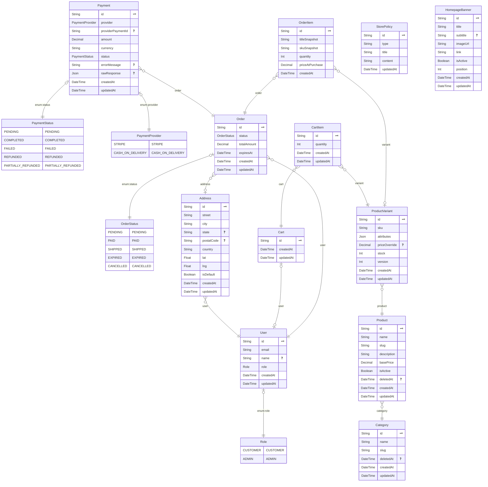

```mermaid
erDiagram

        Role {
            CUSTOMER CUSTOMER
ADMIN ADMIN
        }
    


        OrderStatus {
            PENDING PENDING
PAID PAID
SHIPPED SHIPPED
EXPIRED EXPIRED
CANCELLED CANCELLED
        }
    


        PaymentStatus {
            PENDING PENDING
COMPLETED COMPLETED
FAILED FAILED
REFUNDED REFUNDED
PARTIALLY_REFUNDED PARTIALLY_REFUNDED
        }
    


        PaymentProvider {
            STRIPE STRIPE
CASH_ON_DELIVERY CASH_ON_DELIVERY
        }
    
  "User" {
    String id "🗝️"
    String email 
    String name "❓"
    Role role 
    DateTime createdAt 
    DateTime updatedAt 
    }
  

  "Address" {
    String id "🗝️"
    String street 
    String city 
    String state "❓"
    String postalCode "❓"
    String country 
    Float lat 
    Float lng 
    Boolean isDefault 
    DateTime createdAt 
    DateTime updatedAt 
    }
  

  "Category" {
    String id "🗝️"
    String name 
    String slug 
    DateTime deletedAt "❓"
    DateTime createdAt 
    DateTime updatedAt 
    }
  

  "Product" {
    String id "🗝️"
    String name 
    String slug 
    String description 
    Decimal basePrice 
    Boolean isActive 
    DateTime deletedAt "❓"
    DateTime createdAt 
    DateTime updatedAt 
    }
  

  "ProductVariant" {
    String id "🗝️"
    String sku 
    Json attributes 
    Decimal priceOverride "❓"
    Int stock 
    Int version 
    DateTime createdAt 
    DateTime updatedAt 
    }
  

  "Cart" {
    String id "🗝️"
    DateTime createdAt 
    DateTime updatedAt 
    }
  

  "CartItem" {
    String id "🗝️"
    Int quantity 
    DateTime createdAt 
    DateTime updatedAt 
    }
  

  "Order" {
    String id "🗝️"
    OrderStatus status 
    Decimal totalAmount 
    DateTime expiresAt 
    DateTime createdAt 
    DateTime updatedAt 
    }
  

  "Payment" {
    String id "🗝️"
    PaymentProvider provider 
    String providerPaymentId "❓"
    Decimal amount 
    String currency 
    PaymentStatus status 
    String errorMessage "❓"
    Json rawResponse "❓"
    DateTime createdAt 
    DateTime updatedAt 
    }
  

  "OrderItem" {
    String id "🗝️"
    String titleSnapshot 
    String skuSnapshot 
    Int quantity 
    Decimal priceAtPurchase 
    DateTime createdAt 
    }
  

  "StorePolicy" {
    String id "🗝️"
    String type 
    String title 
    String content 
    DateTime updatedAt 
    }
  

  "HomepageBanner" {
    String id "🗝️"
    String title 
    String subtitle "❓"
    String imageUrl 
    String link 
    Boolean isActive 
    Int position 
    DateTime createdAt 
    DateTime updatedAt 
    }
  
    "User" |o--|| "Role" : "enum:role"
    "Address" }o--|| "User" : "user"
    "Product" }o--|| "Category" : "category"
    "ProductVariant" }o--|| "Product" : "product"
    "Cart" |o--|o "User" : "user"
    "CartItem" }o--|| "Cart" : "cart"
    "CartItem" }o--|| "ProductVariant" : "variant"
    "Order" |o--|| "OrderStatus" : "enum:status"
    "Order" }o--|| "User" : "user"
    "Order" }o--|o "Address" : "address"
    "Payment" |o--|| "PaymentProvider" : "enum:provider"
    "Payment" |o--|| "PaymentStatus" : "enum:status"
    "Payment" }o--|| "Order" : "order"
    "OrderItem" }o--|| "Order" : "order"
    "OrderItem" }o--|o "ProductVariant" : "variant"
```
